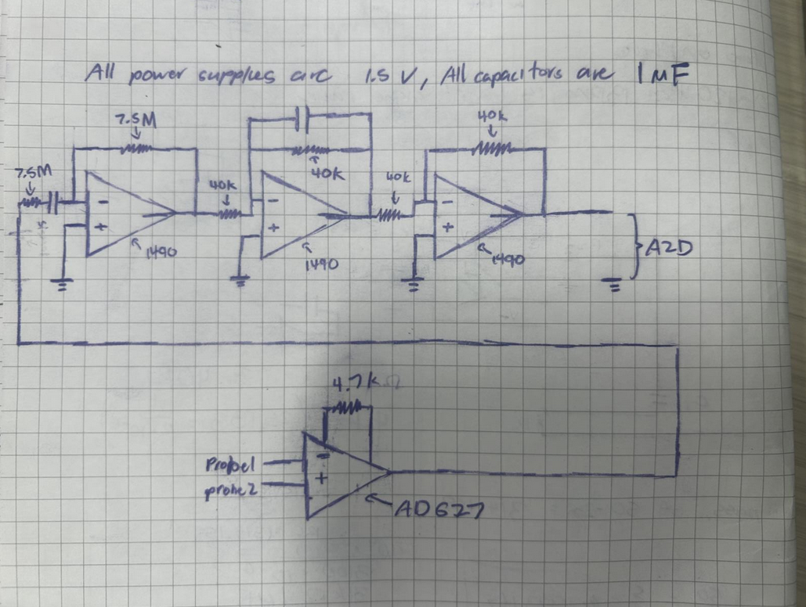
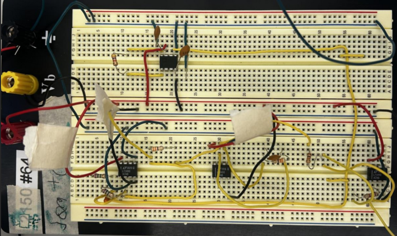
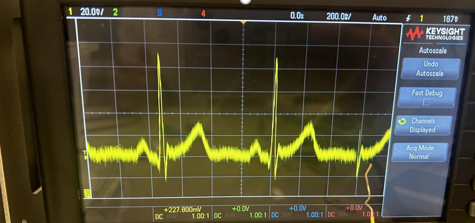
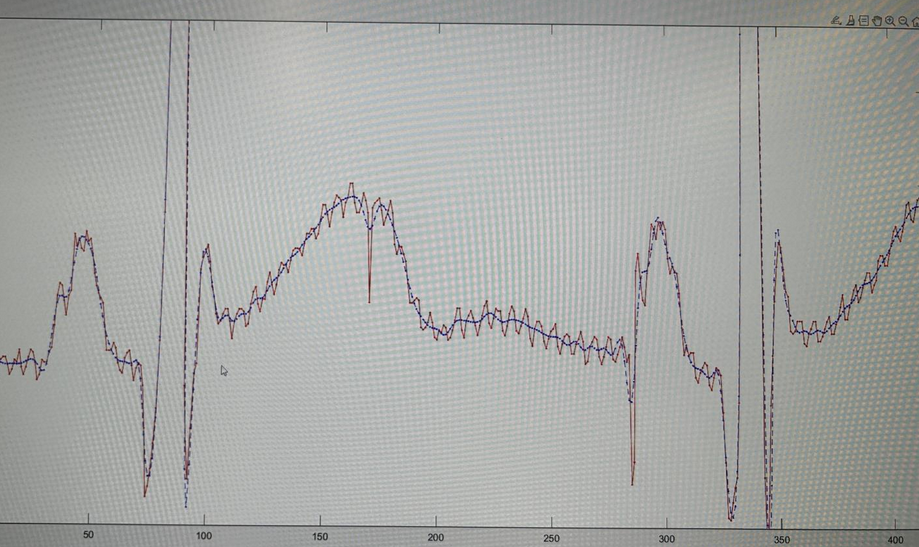
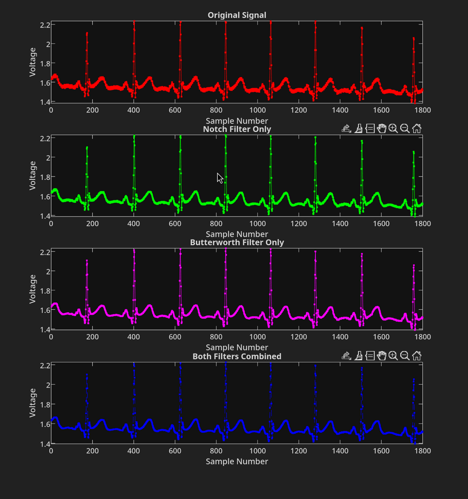

# Circuits and Signals ECG Project

**Authors:** Earl Chan, Sam Elkerton  
**Instructor:** Professor Nicol McGruer  

## Overview
This project implements an ECG signal reader using analog filtering and digital signal processing in MATLAB. The system combines an instrumentation amplifier, active high-pass and low-pass filters, and an analog-to-digital converter to acquire, condition, and analyze cardiac electrical signals.

---

## Analog Filter Design

### Circuit Architecture
The first phase of the project involved designing and building an analog filter circuit on a breadboard. The circuit uses operational amplifiers to condition the raw ECG signal from chest leads before digitization.

**Circuit Components:**
- **Instrumentation Amplifier:** Provides high input impedance and common-mode rejection
- **High-pass Filter:** Cutoff frequency of 5.235 rad/s (0.8333 Hz) using a 1 µF capacitor and 7.5 MΩ resistor to remove DC offset and very low-frequency components
- **Low-pass Filter:** Cutoff frequency of 4 Hz (≈240 BPM maximum) to attenuate high-frequency noise while preserving the heartbeat signal
- **Output Amplifier:** Standard inverting op-amp configuration for signal scaling



The circuit was constructed on a breadboard with careful attention to component selection and signal routing to minimize noise:



### Raw Signal Acquisition
Even without software filtering, the analog circuit produces a readable ECG signal when viewed on an oscilloscope. The raw signal shows the characteristic heartbeat pattern with clear peaks corresponding to heart contractions, though it contains significant high-frequency noise from 60 Hz power line interference and other electrical noise sources.



The unfiltered signal demonstrates why additional filtering is necessary—while the heartbeat is visible, the noise makes precise heart rate detection and signal analysis challenging.

---

## Digital Signal Processing

### Processing Pipeline
After acquiring the analog signal through the A/D converter at 360 Hz sampling rate, we applied additional digital filtering in MATLAB to further clean the signal. The digital processing pipeline consists of two complementary filters:

**Digital Filter Design:**
1. **Butterworth Low-pass Filter:** Passband at 50 Hz with cutoff at 100 Hz to remove high-frequency noise while preserving the cardiac waveform
2. **Notch Filter:** Targets 60 Hz power line interference with a bandwidth of 10 Hz for precise removal

### Filtered Signal Results
The combination of analog and digital filtering produces a dramatically cleaner signal. The comparison below shows the effectiveness of the filtering approach:



As visible in the comparison, the analog filtering removes the bulk of the high-frequency noise, while the digital notch and Butterworth filters further suppress 60 Hz interference and additional noise. The result is a clean ECG waveform where individual heartbeats are clearly distinguishable, with noise in the baseline regions reduced to negligible levels while the characteristic R-wave peaks remain sharp and prominent.

### Filter Response Analysis
To validate our filter design decisions, we examined the frequency response of each filter stage:



The four-panel comparison shows progression through the filtering stages:
- **Original Signal:** Raw data showing full spectral content including power line interference
- **Notch Filter Only:** Demonstrates the targeted removal of 60 Hz interference
- **Butterworth Low-pass Only:** Shows the effect of bandwidth limitation to 50 Hz passband
- **Both Filters Combined:** Final cleaned signal with minimal noise and preserved cardiac features

### Heart Rate Detection
From the digitally-filtered signal, we performed FFT analysis to identify the dominant frequency components corresponding to heart rate. The analysis detected an average heart rate of **84 BPM**, calculated by identifying the peak frequencies in the signal's frequency domain and accounting for the 5-second sampling window.

---

## Key Insights
- Analog filtering provides essential noise reduction before A/D conversion to prevent aliasing
- High-frequency removal is critical—the 4 Hz low-pass cutoff ensures only cardiac signals pass while eliminating muscle noise and instrumentation artifacts
- Digital signal processing complements analog filtering by targeting specific interference sources (60 Hz) and providing precise frequency control
- Combined analog + digital filtering achieves superior noise reduction compared to either approach alone
- The heart rate detection capability enables biomedical monitoring applications and clinical signal analysis

## Repository Structure
```
code/
  filter.m   - Signal acquisition and digital filtering (Butterworth + notch filters)
  plot.m     - ECG analysis, heart rate detection via FFT, and visualization
  analyze.m  - Main script orchestrating data acquisition and analysis
```